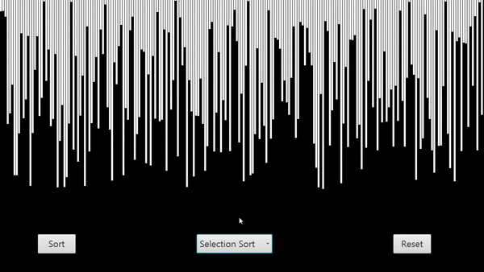

# algorithm-visualizer

## Overview

This is a sorting algorithm visualizer project made with the purpose of learning how to  work with sorting algorithms
and threads, as well as practicing implementing various design patterns.

Design patterns used :\
1- MVC.\
2- Strategy Pattern.\
3- Factory Method.\
4- Observer Pattern.

## How to run the project

1- Download source code as zip (or clone the project).\
2- Compile and run the project using command line or some IDE (eg. IntelliJ).\
3- Select the desired sorting algorithm and press the "Sort" button.

## Demo

Below is a demo that shows a couple of the implemented sorting algorithms (Merge Sort and Quick Sort)

